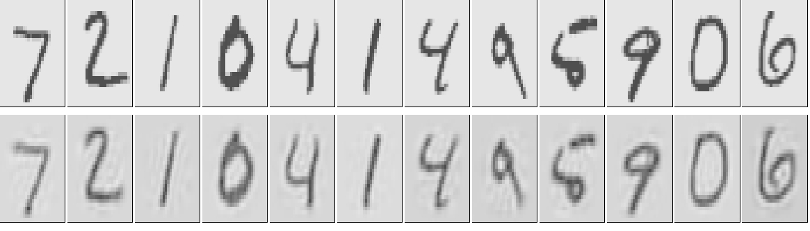

```{r setup, include=FALSE, message=FALSE}
#library(MASS)
#library(klaR)
library(tufte)
#library(tidyverse)
library(ggplot2)
library(gridExtra)
#library(caret)
#library(rsample)
library(ISLR2)
library(knitr)
#library(kernlab)
#library(e1071)
#library(AppliedPredictiveModeling)
#library(kableExtra)
#library(rpart)
#library(party)
#library(partykit)
#library(rpart.plot)
# invalidate cache when the tufte version changes
knitr::opts_chunk$set(tidy = FALSE, 
                      cache.extra = packageVersion('tufte'),
                      kable.force.latex = TRUE,
                      fig.margin = TRUE, 
                      fig.height = 5, 
                      fig.width = 6)
options(htmltools.dir.version = FALSE)
```


\newpage

# Introduction

Deep learning is one of the most active areas in machine learning and artificial intelligence communities. It is a specific subfield of machine learning that is based learning successive layers of increasingly meaningful representations of the data. The "deep" in deep learning represents the idea of successive layers of representations of the data -- it does not refer to any kind of deeper understanding of the data achieved by the approach.  Modern deep learning models often involve many (tens or even hundreds) successive layers of representations. These layers are trained learned automatically from the training data. Other approaches to machine learning tend to focus on learning only one or two layers of representations of the data and hence they are sometimes called *shallow learning*.

```{r slnn, fig.cap="Structure of a single layer neural network. An input layer with four predictors, X1, X2, X3, and X4, is shown. These four predictors are mapped to a hidden layer with five nodes, A1, A2, A3, A4, and A5. The hidden layer is then mapped to the output layer, f(X).", fig.margin = TRUE, fig.fullwidth = FALSE, echo=FALSE}

```

The cornerstone of deep learning is the *neural network*. Specifically, the layered representations are modeled using neural networks. The term neural network has evolved to encompass a large class of models and learning methods. Essentially, they are *nonlinear statistical models*. The simplest form of a neural network, sometimes called the *single hidden layer back-propagation network* or *single layer perceptron* is a two-stage regression or classification model. Modern neural networks, however, have more than one hidden layer, and often many units per layer. In theory a single hidden layer with a large number of units has the ability to approximate most functions. However, the learning task of discovering a good solution is made much easier with multiple layers each of modest size. We discuss both these types of networks in the following sections.


# Single Layer Neural Networks

A single layer neural network is a two-stage regression or classification model, typically represented by a network diagram. Here we only show one output variable $Y$ (as often the case for usual regression problems), but in general $Y$ can be a vector of output variables, $Y_1, \ldots, Y_J$.  For example, in a multiclass classification problem, the output $Y_j$ can be coded as dummy variable for the $j$-th class. 

Formally, suppose we have input variables $X = (X_1, \ldots, X_p)$. The neural network builds a nonlinear function $f(X)$ to predict the response $Y$.  The concept is similar to the models we have discussed for far (nonlinear regression models such as splines, SVM, trees etc.); neural networks however use a particular structure to build such nonlinear models. For example, the previous image shows a feed-forward neural network for modeling one quantitative response $Y$ using $p=4$ predictors. The arrows indicate that each of the inputs from the input layer feeds into each of the $K$ hidden units in the hidden layer. In this example, we have $K=5$ hidden units, denoted by $A_1, \ldots, A_5$, also called *activations*.  The activations are computed as functions of the input features:
$$
A_k  = h_k(X) = g(w_{k0} + \sum_{j = 1}^p w_{kj}X_j),
$$
where $g(z)$ is a nonlinear *activation function* that is specified in advance, and $w_{k0}, \ldots, w_{kp}$ are parameters to be estimated from the data. We can think of each $A_k$ as a different transformation $h_k(X)$ of the original features. (This concept is much like the basis functions.) These $K$ activations
from the hidden layer then feed into the output layer using the form 
$$
f(X) = \beta_0 + \sum_{k=1}^K \beta_k A_k = \beta_0 + \sum_{k=1}^K \beta_k h_k(X),
$$
where the coefficients $\beta_0, \ldots, \beta_K$ are parameters to be estimated from the data. This is the final form the neural network shown in the previous image. Note that the hidden layer units are not observed directly, but are learned during the training of the network. The output layer is a linear model that uses these activations $A_k$ as inputs, resulting in a function $f(X)$.

There are a few choices for the activation function such as *sigmoid*
$$
g(z) = \frac{1}{1 + e^{-z}},
$$
or rectified linear unit (ReLU)
$$
g(z) = z I(z > 0).
$$

```{r act, echo=FALSE, fig.cap="The sigmoid (blue) and ReLU (orange) activations. The sigmoid function starts near 0 and increases towards 1 in an 'S' shape. The ReLU function is 0 for negative values and then linear from 0 on."}
x <- seq(-3, 3, len=51)
s <- 1/(1 + exp(-x))
r <- x * I(x > 0)
d <- cbind(s, r)
matplot(x, d, type = "l", lwd=2, col = c("blue", "orange"), lty=1,
        xlab = "z", ylab = "g(z)")
```

In early days, the sigmoid function, which is the same function used in logistic regression to convert a linear function into probabilities between zero and one, was favored as activation function. The preferred choice in modern neural networks is the ReLU function, which can be computed and stored more efficiently than a sigmoid activation. Sometimes Gaussian radial basis functions are used, producing what is known as a *radial basis function network*. There are many other activation functions such as *softmax* (used in classification problems), exponential, hyperbolic tangent, and so on.

The nonlinearity in the activation function is essential to capture nonlinear effects of the predictors. If $g(z)$ is linear then the activations $A_k$ will also be linear, and thus the model $f(X)$ would be a simple linear model in the predictors. Moreover, having a nonlinear activation function allows the model to capture complex interaction effects of the predictors. 

# Fitting a neural netwrok

To fit a neural network to a data set, we need estimate the unknown parameters $w_{kj}, j = 0, \ldots, p; k = 1,\ldots, K$ and $\beta_0, \ldots, \beta_K$. For a quantitative response (in a regression problem) we do so by minimizing the squared error loss
$$
\sum_{i=1}^n (Y_i - f(X_i))^2 
$$
with respect to $w_{kj}$ and $\beta_k$, $j = 0, \ldots, p; k = 1,\ldots, K$. A challenge of this optimization is that the loss above is a nonconvex function of the parameters and hence there are multiple solutions (i.e., both *local* and *global* minimum exist). The image below shows a one-dimensional example of such a nonconvex function. This problem is further compounded for multi-layer networks.   

```{r ncv, echo=FALSE, fig.cap="Illustration of gradient descent for one-dimensional problem. The objective function is not convex, and has two minima, one at -0.46 (local), the other at 1.02 (global). Starting at some randomly chosen value, each step moves downhill - against the gradient - until it cannot go down any further. Here gradient descent reached the global minimum in 7 steps.",}

knitr::include_graphics("img/10_17.pdf")
```

To overcome some of these issues and to protect from overfitting, two general strategies are employed when fitting neural networks.

+ *Slow Learning:* the model is fit in a somewhat slow iterative fashion, using *gradient descent*. The fitting process is then stopped when overfitting is detected.

+ *Regularization:* penalties are imposed on the parameters, usually lasso
or ridge.

## Gradient descent and backpropagation

\noindent The idea of gradient descent is very simple. We Start with a guess for all the parameters in the model (typically randomly chosen). Then we find a small change in the parameter values such that it reduces the objective. Then we iterate this process until the objective function fails to decrease. The figure above gives an example of the gradient  descent for a one-dimensional problem. Here $R(\cdot)$ denotes the objective, and $\theta$ denotes the parameter. We start from $\theta^0$ and gradually reach the global minimum at $\theta^7$. However, depending on the starting point, we might end up in a local minimum. In general, we can hope to end up at a good local minimum. The direction to move so as to decrease the objective is determined by a process known as *backpropagation* in the neural network literature. We will not go into mathematical details here. Interested readers should consult the textbook (Chapter 10.7) or Chapter 11.4 of *Elements of Statistical Learning*. 

## Stochastic Gradient Descent

Gradient descent usually takes many steps to reach a local minimum. In practice, there are a number of approaches for accelerating the process. Also, when $n$ is large, instead of using all the $n$ observations, we can sample a small fraction or *minibatch* of them each time we compute a gradient step. This process is known as stochastic gradient descent (SGD) and is the state of the art for learning deep neural networks. In this context, the term `epoch` refers to the number of times an equivalent of the full training set has been processed. For example, if we have a sample size 100 with batch size 20, then each epoch will have $100/20 = 5$ SGD steps. 

## Regularization

Another approach to avoid overfitting (especially when number of parameters are very large in multi-layered netwroks) is to augment a penalty term (e.g., ridge penalty) to the loss function. The penalty parameter is often preset at a small value, or else it is found using data splitting methods. We can also use different values of the penalty parameter for the groups of weights from different layers.

## Dropout Learning

Dropout learning is a relatively new and efficient form of regularization, similar in some respects to ridge regularization. Inspired by random forests, the idea is to randomly remove a fraction of the units in a layer when fitting the model. This is done separately each time a training observation is processed. The surviving units stand in for those missing, and their weights are scaled up to compensate. This prevents nodes from becoming over-specialized, and can be seen as a form of regularization. In practice dropout is achieved by randomly setting the activations for the *dropped out* units to zero, while keeping the architecture intact.

## Fitting in R

In R, we are going to use `keras` package to fit neural networks. See `keras.rstudio.com` or `www.statlearning.com` for step-by-step instructions on
how to setup `keras`. In this example, we will use `Hitters` data to demonstrate a single layer neural network.  

First, we load the data, and `keras` library. We explicitly separate the response and predictors. To create the predictors, we actually create the model matrix so that any categorical variables will be automatically converted to the corresponding dummy variable. Finally, we standardize each predictor, and take a log transformation of the response. For testing purposes, we also split the data into training and test sets.

```{r, warning=FALSE, message=FALSE}
## Load keras and Hitters data 
library(keras)
Hitters <- na.omit(ISLR2::Hitters)
## response y, preditor x
x <- model.matrix(Salary ~ . - 1, data = Hitters) %>% 
  scale()
y <- log(Hitters$Salary)
## training and test sets
set.seed(1001)
n <- nrow(x)
ind <- sample(1:n, round(n*0.3), replace = FALSE)

xtest <- x[ind, ]
ytest <- y[ind]

xtrain <- x[-ind, ]
ytrain <- y[-ind]
```
\noindent Notice that we have used `%>%` (pipe) operator here. We can simply understand this operator as "then". Specifically, `x %>% f()` would read as "take `x`, and then apply `f()`". Thus `x %>% f()` is equivalent to `f(x)`. This notation is particularly useful when we chain multiple functions, as we will do when building (adding layers) a neural network. For example, instead of writing

```{r, eval=FALSE}
h(g(f(x)))
```
\noindent it is much easier to write/read
```{r, eval=FALSE}
x %>% 
  f() %>%
  g() %>%
  h()
```

Now let us specify the network structure, as shown in the code chunk below. Here we start with `keras_model_sequential()` to specify that the network is a stack of layers. The next command `layer_dense()` specifies the first hidden layer (with 64 hidden units with ReLU activation)^[See `?activation_relu` for available activation functions in the `keras` package.]. The input_shape argument specifies the dimension of the predictors. Finally, we have the output layer with only one unit that computes $f(\X)$. Notice that we do not need to specify the input layer -- we just need to  use the `input_shape` argument in the first layer. Also the output layer has no activation function, indicating that the model provides a single quantitative output, as is. Optionally, we can use the command `layer_dropout()`, commented out in the code below, to specify the parameters for dropout learning. Specifically, a randomly chosen 40\% of the 64 activations from the previous layer are set to zero during each iteration of the stochastic gradient descent algorithm. This step may protect against overfitting. 

```{r, echo=FALSE, message=FALSE, warning=FALSE}
network <- load_model_hdf5("Ch08_saved_nn_models/hitters_single.h5")
load("Ch08_saved_nn_models/hitters_single_hist")
```

```{r, eval=FALSE}
network <- keras_model_sequential() %>%
  layer_dense(units = 64, activation = "relu", 
              input_shape = ncol(x)) %>%
  #layer_dropout(rate = 0.4) %>%
  layer_dense(units = 1)
```
```{r}
network
```

The network above is just the structure -- it does not have access to the actual data (x and y) yet. We see that there are $1,409$ parameters. The output layer has 65 parameters since we have 64 activation units and one intercept.^[Recall $f(X) = \beta_0 + \sum_{k=1}^K \beta_k A_k$. Here $K=64$.] The hidden layer has 1,344 parameters because each activation has $p+1$ parameters. Here $p=20$. Thus we have, for 64 activations, $64 * 21 = 1344$ parameters. 

Next, we need to compile the network. In this step, we need to specify a *loss function* to measure its performance on the training data, *an optimizer* through which the network will update itself, and *metrics* to monitor during training and testing. Here we have used the squared error loss (mse), with the "RMSprop" (Root Mean Squared Propagation)^[An adaptive gradient-based optimization technique.] optimizer, and mean absolute error as our metric. 


```{r, warning=FALSE, message=FALSE, eval=FALSE}
network %>% compile(loss = "mean_squared_error",
                    optimizer = optimizer_rmsprop(),
                    metrics = list("mean_absolute_error"))
```

\noindent Note that we are not assigning the result of the compilation to a new variable. Instead, the `compile()` function modifies the existing network in place. 

Finally, we are ready to train the network using the data set at hand. We do so by calling the `fit()` function. 

```{r, results='hide', eval=FALSE}
history <- network %>% fit(xtrain, ytrain, 
                           epochs = 200, batch_size = 32,
                           validation_data = list(xtest, ytest))
```

```{r nnhist, fig.cap="Training abd test set metrics over epochs.", message=FALSE, warning=FALSE, echo=FALSE}
plot(history, smooth = FALSE)#, theme_bw = TRUE)
```

\noindent Here we supply the training data and two fitting parameters, `epochs` and `batch\_size`. Here batch size of 32 means that at each step of SGD, the algorithm randomly selects 32 training observations for the computation of the gradient.  Here an epoch amounts to the number of SGD steps required to process all training observations. Since we have `r nrow(xtrain)` training observations, and we set batch size of 32, an epoch is `r nrow(xtrain)`/32 $\approx$ `r round(nrow(xtrain)/32,1)` SGD steps. The argument `validation_data` specifies the data to be used as validation. The model will set apart this data, will not train on it, and will evaluate the loss and any model metrics on this data at the end of each epoch. The output `history` stores the evaluation metrics for the training as well as test sets. Figure \ref{fig:nnhist} shows training and validation metrics over epochs.


Thus we have trained a single layer neural network model. It is worth noting that if you run the `fit()` command a second time in the same R session, then the fitting process will pick up where it left off. Now we can use the predict command as usual to get predictions for new data. Figure \ref{fig:nnpred} shows the predicted values against observed response in the test set.  

```{r nnp, echo=FALSE, fig.cap="Training phase metrics over epochs.", fig.height=8, include=FALSE, eval=FALSE}

```

```{r, warning=FALSE, message=FALSE}
pred <- predict(network, xtest)
MSE <- mean((ytest - pred)^2)
abs_err <- mean(abs(ytest - pred))
c(MSE = MSE, MAE = abs_err)
```

```{r nnpred, fig.cap="Prediction of the test set using a single layer neural network model.", echo=FALSE}
plot(ytest, pred, pch = 19, 
     xlab = "Test set observed response",
     ylab = "Predicted values",
     xlim = range(y), ylim = range(y))
abline(a = 0, b=1, lty=2)
```


## Classification 

So far we have discussed regression problems. For a classification problem with $J$ classes, our output variable variables can be $Y_{ij}$, a binary variable taking the value 1 if the $i$-th item in the sample is in the $j$-th class, 0 otherwise. Thus in the output layer, instead of having one function $f(X)$, we will have $J$ such functions $f_j(X), j = 1, \ldots, J$. However we need to keep in mind that the output functions $f_j(\X)$ are not guaranteed to be probabilities as they can take any value. Even if use sigmoid activations to restrict their values between 0 and 1, they might not sum to 1. Thus, a further activation is often used in the output layer to convert them to probability like quantities (non-negative and add up to 1). Thus, rather than setting $f_j(X)$ to be simply $\beta_{0j} + \sum_{k=1}^K \beta_{kj} A_k$, we set
$$
f_j(X) = g_j(T_1, \ldots, T_J),
$$
with $T_j = \beta_{0j} + \sum_{k=1}^K \beta_{kj} A_k$, where $g_j(\cdot)$ are pre-specified activation functions.^We can think the regression problem as a special case of this formulation with $g_j(\cdot)$ being the identity function.] Typically, we use the *softmax*^[Recall our discussion about softmax in multinomial logistic regression.] acivation here:
$$
g_j(T_1, \ldots, T_J) = \frac{e^{T_j}}{e^{T_1} + \ldots + e^{T_J}}.
$$
With the setup above, in a classification problem, we can minimize either squared error loss or cross-entropy
$$
-\sum_{i=1}^n \sum_{j=1}^J Y_{ij} \, log(f_j(X_i)) 
$$
The corresponding classifier assigns a new unit to class $j$ is $f_j$ for the new unit is largest.^[With the softmax activation function and the cross-entropy error function, the neural network model is exactly a linear logistic regression model in the hidden units, and all the parameters can be estimated by maximum likelihood.] 

Let us consider the MNIST image data set available in `keras`. The data set consists of images of handwritten digits (0 -- 9), and the corresponding 
labels. Let us use a single layer neural network to build a classifier. The data already contains training set of $60,000$ images and test set of $10,000$ images.

First, we load the training and test sets.

```{r}
# Load train/test sets fo MNIST data 
mnist <- dataset_mnist()
str(mnist)
```
\noindent As we see above, we have $28 \times 28$ images stored as a three-dimensional array, so we need to reshape them into a matrix. Each image has values between 0 to 255. We will also scale them to be between 0 and 1. Finally, we will create indicator variables for each class label. There are 10 possible classes (0 -- 9), and thus we will have 10 such indicators. 

```{r}
set.seed(1001)
# Prep training set
train_images <- mnist$train$x %>%
  array_reshape(c(60000, 28 * 28))
train_images <- train_images / 255
train_labels <- mnist$train$y %>%
  to_categorical(10)
# Prep test set
test_images <- mnist$test$x %>%
  array_reshape(c(10000, 28 * 28))
test_images <- test_images / 255
test_labels <- mnist$test$y %>%
  to_categorical(10)
```

Now we build our neural network just as before. The only change is the output layer -- it now has 10 units (one for each class), and a softmax activation. In the compilation step, the changes are the loss function (cross-entropy) and metric (accuracy). In the training phase, we specify a validation split of $20\%$, so the training is actually performed on $80\%$ of the 60,000 observations in the training set. This is an alternative to actually supplying validation data.

```{r, echo=FALSE, warning=FALSE, message=FALSE}
network <- load_model_hdf5("Ch08_saved_nn_models/mnist_single_layer.h5")
load("Ch08_saved_nn_models/mnist_single_layer_hist")
```

```{r, results='hide', eval=FALSE}
## set up netwrok
network <- keras_model_sequential() %>%
  layer_dense(units = 512, activation = "relu", 
              input_shape = c(28*28)) %>%
  layer_dense(units = 10, activation = "softmax")
```

```{r}
network
```

```{r, results='hide', eval=FALSE}
## compile network
network %>% compile(
  optimizer = optimizer_rmsprop(),
  loss = "categorical_crossentropy",
  metrics = c("accuracy")
)
## training
history <- network %>% 
  fit(train_images, train_labels, 
      epochs = 15, batch_size = 128,
      validation_split = 0.2)
```

```{r classnn, fig.cap="Training and validation metrics for the MNIST image data."}
plot(history, smooth = FALSE, theme_bw = TRUE)
```

We predict the classes of the test set and compute the test accuracy (and other statistics) as follows.
```{r, warning=FALSE, message=FALSE}
pred <- predict_classes(network, test_images)
conf <- caret::confusionMatrix(data = as.factor(pred),
                               reference = as.factor(mnist$test$y))
conf$overall
```


It is worth noting that we can also employ multinomial logit regression easily using `keras`. We simply need to omit the hidden layer, and just keep the output layer with softmax activation.

```{r, echo=FALSE, warning=FALSE, message=FALSE}
mlogit <- load_model_hdf5("Ch08_saved_nn_models/mnist_mlogit.h5")
load("Ch08_saved_nn_models/mnist_mlogit_hist")
```

```{r, eval=FALSE}
set.seed(1001)
## Multinomial logit regression
mlogit <- keras_model_sequential() %>%
  layer_dense(input_shape = 28*28, 
              units = 10, activation = "softmax")
```

```{r}
mlogit
```

```{r, eval=FALSE}
## compile network
mlogit %>% compile(
  optimizer = optimizer_rmsprop(),
  loss = "categorical_crossentropy",
  metrics = c("accuracy")
)
## training
history <- mlogit %>% 
  fit(train_images, train_labels, 
      epochs = 15, batch_size = 128,
      validation_split = 0.2)
```

```{r}
## prediction
pred <- predict_classes(mlogit, test_images)
conf <- caret::confusionMatrix(data = as.factor(pred),
                               reference = as.factor(mnist$test$y))
conf$overall
```


# Multilayer Neural Networks

In most practical problems, we often use multiple hidden layers. In theory a single hidden layer with a large number of units should be able to approximate most functions. However, the learning task of discovering a good solution is made much easier with multiple layers each of modest size. Figure \ref{fig:mnn} shows an example of a neural network with two hidden layers (and multiple output variables).

```{r mnn, echo=FALSE, fig.cap="Example of a neural network with two hidden layers."}
knitr::include_graphics("MLNN.jpg")
```

In context of Figure \ref{fig:mnn}, the first hidden layer has the form
$$
A_k^{(1)} = h_k^{(1)}(X) = g(w_{k0}^{(1)} + \sum_{j = 1}^p w_{kj}^{(1)}X_j),
$$
for $k = 1, \ldots, K_1$. The second hidden layer uses the activation of the first hidden layer as inputs, and computes new activations
$$
A_\ell^{(2)} = h_\ell^{(2)}(X) = g(w_{\ell 0}^{(2)} + \sum_{k = 1}^{K_1} w_{\ell k}^{(2)}A_k^{(1)}),
$$
for $\ell = 1, \ldots, K_2$. Thus, through a chain of transformations, the network is able to build up fairly complex transformations of the original predictors $\X$ that ultimately feed into the output layer as features.^[In machine learning literature, it is common to use *weights* and *bias* in place of slope and intercept.] In terms of notation, the symbol $W_1$ in Figure \ref{fig:mnn} represents the entire matrix of weights that feed from the input layer to the first hidden layer. This matrix will have $(p+1) \times K_1$ elements. Similarly, $W_2$ represents the $(K_1+1) \times K_2$ matrix of weights that feed from the first hidden layer to the second hidden layer. Finally, the matrix $B$ is made of the weights that feed from the second hidden layer to the output layer. 

In general, we can have many hidden layers, resulting in a large number of parameters. Dropout based regularization or L1/L2 regularization might be preferred in this case to avoid overfitting the trainig data. 

Let us now revisit the MNIST data example, but using a neural network with two hidden layers instead of one. The following code does so -- the only change  from the previous code is the extra `layer_dense` call with 256 units in building the network, and the two dropout layers for regularization.^[Try the network without the dropout layers to compare performance.] 

```{r, echo=FALSE, warning=FALSE, message=FALSE}
network <- load_model_hdf5("Ch08_saved_nn_models/mnist_multi_layer.h5")
load("Ch08_saved_nn_models/mnist_multi_layer_hist")
```

```{r, results='hide', eval=FALSE}
set.seed(1001)
## set up network
network <- keras_model_sequential() %>%
  layer_dense(units = 512, activation = "relu", 
              input_shape = c(28*28)) %>%
  layer_dropout(rate = 0.4) %>%
  layer_dense(units = 256, activation = "relu") %>%
  layer_dropout(rate = 0.2) %>%
  layer_dense(units = 10, activation = "softmax")
```

```{r}
network
```

```{r, results='hide', eval=FALSE}
## compile network
network %>% compile(
  optimizer = optimizer_rmsprop(),
  loss = "categorical_crossentropy",
  metrics = c("accuracy")
)
## training
history <- network %>% 
  fit(train_images, train_labels, 
      epochs = 15, batch_size = 128,
      validation_split = 0.2)
```

```{r classnnml, fig.cap="Training and validation metrics for the MNIST image data."}
plot(history, smooth = FALSE, theme_bw = TRUE)
```


```{r, warning=FALSE, message=FALSE}
## Prediction
pred <- predict_classes(network, test_images)
conf <- caret::confusionMatrix(data = as.factor(pred),
                               reference = as.factor(mnist$test$y))
conf$overall
```

## Network Tuning

The network in Figure \ref{fig:mnn} is considered to be relatively straightforward. We still require to make a number of choices that all have an effect on the performance:

+ The number of hidden layers, and the number of units per layer. Modern
thinking is that the number of units per hidden layer can be large, and overfitting can be controlled via the various forms of regularization.

+ Regularization tuning parameters. These include the dropout rate, and the strength of lasso and ridge regularization, and are typically set separately at each layer.

+ Details of stochastic gradient descent. These includes the batch size and the number of epochs. 

\noindent In preparing this MNIST example, we achieved a respectable 1.8% misclassification error. The tinkering process can be tedious, and can result in overfitting if done carelessly.

In practice, we may need to train several thousands of models before we choose one final model. For example, consider the MNIST example above where we consider three sizes, $(64, 128, 256)$, and dropout rates, $(0.2, 0.3, 0.4)$, for each of the two layers. Also, we intend to investigate two learning rates, $(0.1, 0.05)$, and two optimizers, `rmsprop` and `adam`. In total, this leads to $3^2 * 3^2 * 2 * 2= `r 3^2 * 3^2 * 2 * 2`$ training runs. If we had another layer (i.e., a tree layer network), the number of training runs would be  $3^3 * 3^3 \* 2 * 2= `r 3^3 * 3^3 * 2 * 2`$. Manually fitting this many models is impractical (and often not feasible). Instead we can use grid search. For most implementations we need to predetermine the number of layers we want and then establish a search grid. We can use `h2o`'s `h2o.deeplearning()` function, for example, to create and execute the grid search. In what follows, we will demonstrate another R package `tfruns` to monitor several training runs with `keras`. 

For `keras`, we use `flags` to control search grids -- this implementation provides added flexibility for tracking, visualizing, and managing training runs with the `tfruns` package.^[Allaire, JJ. (2018). Tfruns: Training Run Tools for ’Tensorflow’. https://CRAN.R-project.org/package=tfruns. For a full discussion regarding flags see the https://tensorflow.rstudio.com/tools/ online resource.]

First, we need to set up a training script. The following code is saved in the file `mnistnn.R`. Notice that we have defined the learning parameters in the variable `train_flags` using the `flags()` function. Then when we build/train the model, we simply refer to appropriate fields of `train_flags` instead to explicitly specifying numeric values.  

```{r, eval=FALSE}
## Load keras
library(keras)

## Prep data
mnist <- dataset_mnist()
# Prep training set
train_images <- mnist$train$x %>%
  array_reshape(c(60000, 28 * 28))
train_images <- train_images / 255
train_labels <- mnist$train$y %>%
  to_categorical(10)
# Prep test set
test_images <- mnist$test$x %>%
  array_reshape(c(10000, 28 * 28))
test_images <- test_images / 255
test_labels <- mnist$test$y %>%
  to_categorical(10)

## Flags for training
train_flags <- flags(
  # Nodes
  flag_numeric("nodes1", 256),
  flag_numeric("nodes2", 128),
  # Dropout
  flag_numeric("dropout1", 0.4),
  flag_numeric("dropout2", 0.3),
  # Learning paramaters
  flag_string("optimizer", "rmsprop"),
  flag_numeric("lr_annealing", 0.1)
)

## Build and fit the model
model <- keras_model_sequential() %>%
  layer_dense(units = train_flags$nodes1, 
              activation = "relu", 
              input_shape = ncol(train_images)) %>%
  layer_dropout(rate = train_flags$dropout1) %>%
  layer_dense(units = train_flags$nodes2, 
              activation = "relu") %>%
  layer_dropout(rate = train_flags$dropout2) %>%
  layer_dense(units = 10, 
              activation = "softmax") %>%
  compile(loss = 'categorical_crossentropy',
          metrics = c('accuracy'),
          optimizer = train_flags$optimizer
  ) %>%
  fit(x = train_images, 
      y = train_labels,
      epochs = 35,
      batch_size = 128,
      validation_split = 0.2,
      callbacks = list(
        callback_early_stopping(patience = 5),
        callback_reduce_lr_on_plateau(factor = train_flags$lr_annealing)
        ),
      verbose = FALSE
  )
```

Next, we execute the grid search by using `tfruns::tuning_run()`. The following code block does so. 

```{r, eval=FALSE}
library(tfruns)
runs <- tuning_run("mnistnn.R", 
                   runs_dir = "runs"
                   flags = list(
                     nodes1 = c(64, 128, 256),
                     nodes2 = c(64, 128, 256),
                     dropout1 = c(0.2, 0.3, 0.4),
                     dropout2 = c(0.2, 0.3, 0.4),
                     optimizer = c("rmsprop", "adam"),
                     lr_annealing = c(0.1, 0.05)
                   ),
                   sample = 0.05
)
```
\noindent Note that the `flags` argument gives all the possible values we want to investigate for each node (node sizes and dropout) and overall network (optimizer and learning rate). Also the `sample` argument specifies how many models are actually evaluated. In our case, we have a total `r 3^2 * 3^2 * 2 * 2` possible training runs. Instead of running all of them (you may run all of them if you wish), we *randomly choose* 5\% of these models (17 models), and run those. We choose the best among these models. While this is not necessary for our rather small network, such a strategy is quite helpful for larger networks where the total number of training runs are simply too large to evaluate all. The argument `runs_dir = "mnist_tuning"` specifies which directory (in the working directory) is used to save the results from the runs.  


Once the runs are complete, we can view the best result as follows. 
```{r, eval=FALSE}
# min validation loss
ind <- which.min(runs$metric_val_loss)
runs[ind,]
```

```{r, eval=FALSE}
cat('
 $ run_dir            : chr "runs/2021-11-15T20-12-35Z"
 $ metric_loss        : num 0.0288
 $ metric_accuracy    : num 0.99
 $ metric_val_loss    : num 0.0791
 $ metric_val_accuracy: num 0.98
 $ metric_lr          : num 0.001
 $ flag_nodes1        : int 256
 $ flag_nodes2        : int 128
 $ flag_dropout1      : num 0.2
 $ flag_dropout2      : num 0.3
 $ flag_optimizer     : chr "adam"
 $ flag_lr_annealing  : num 0.1
 $ epochs             : int 35
 $ epochs_completed   : int 14
 $ metrics            : chr "(metrics data frame)"
 $ model              : chr "(model summary)"
 $ loss_function      : chr "categorical_crossentropy"
 $ optimizer          : chr "<tensorflow.python.keras.optimizer_v2.adam.Adam>"
 $ learning_rate      : num 0.001
 $ script             : chr "mnistnn.R"
 $ start              : POSIXct[1:1], format: "2021-11-15 20:12:42"
 $ end                : POSIXct[1:1], format: "2021-11-15 20:13:20"
 $ completed          : logi TRUE
 $ output             : chr "(script ouptut)"
 $ source_code        : chr "(source archive)"
 $ context            : chr "local"
 $ type               : chr "training"
')
```
\noindent The optimal model has a validation loss of 0.0791 and validation accuracy rate of 0.98 and the hyperparameter settings for this optimal model are shown above as well. 


# Convolutional Neural Networks

Now let us discuss a specific type of neural network called convolutional neural networks (CNN), also known as *convnets*. This type of models are almost universally used in computer vision applications, such as image classification. 

The neural network models we have discussed so far essentially use *global* features of the input data to perform classification tasks. in contrast, convnets mimic to some degree how humans classify images, by *recognizing specific features or patterns anywhere in the image* that distinguish each particular object class. The network first identifies low-level features in the input image, such
as small edges, patches of color etc. These low-level features are then combined to form higher-level features. Eventually, the presence or absence of these higher-level features contributes to the probability of any given output class. 

Let us revisit the MNIST digits data. Dense layers learn global patterns in their input feature space - for an MNIST digit, patterns involving all pixels are used. Convnets, on the other hand, learn *local patterns*: in the case of images, patterns found in small two-dimensional windows of the inputs. Figure \ref{fig:exwin} shows an example of such local windows on a MNIST image. Operationally, CNNs combine two specialized types of hidden layers, called *convolution layers* and *pooling layers*. Convolution layers search for instances of small patterns in the image, whereas pooling layers downsample these to select a prominent subset. In order to achieve state-of-the-art results, contemporary neural network architectures make use of many convolution and pooling layers.

```{r exwin, echo=FALSE, fig.cap="Examples for 3x3 windows of a MNIST image.", fig.width=5, fig.height=5}
mnist <- dataset_mnist()
c(c(train_images, train_labels), c(test_images, test_labels)) %<-% mnist
train_images <- array_reshape(train_images, c(60000, 28, 28, 1))
train_images <- train_images / 255
test_images <- array_reshape(test_images, c(10000, 28, 28, 1))
test_images <- test_images / 255
train_labels <- to_categorical(train_labels)
test_labels <- to_categorical(test_labels)

dsq <- function(xleft, ybottom, xright, ytop){
  rect(xleft - 0.5, ybottom - 0.5, 
       xright - 0.5, ytop - 0.5, 
       lwd = 2, border = "green")
}
img <- t(test_images[2,,,1])[,28:1]
image(1:28, 1:28,  img, 
      col = gray.colors(256), axes = FALSE, 
      xlab = "", ylab = "")
grid(nx = 28)
dsq(8, 20, 11, 23)
dsq(16, 23, 19, 26)
```

There are two key characteristics of convnets:

1. *The patterns they learn are translation invariant.* After learning a certain pattern in any part of an image, a convnet can recognize it anywhere. In contrast, a densely connected network would have to learn the pattern again if it appeared at a new location. This makes convnets efficient when processing images as they need fewer training samples to learn useful data representations.

2. *They can learn spatial hierarchies of patterns.* (see figure 5.2) first convolution layer will learn small local patterns such as edges, a second convolution layer will learn larger patterns made of the features of the first layers, and so on. This allows convnets to efficiently learn increasingly complex and abstract visual concepts.

\noindent Let us discuss the details of the two layers below.

## Convolution Layers

A convolution layer is made up of a large number of *convolution filters*, each of which is a template that determines whether a particular local feature is present in an image. A convolution filter relies on the convolution operation, which basically amounts to repeatedly multiplying matrix elements and then adding the results. 

In our MNIST example, the input image is of dimension $28 \times 28 \times 1$. The first two dimensions are `height` and `width` (spatial axes) and the last dimension is `depth` or `channel` axis. In MNIST image example, the images are in grayscale and thus we only have one channel. If we have an color image in RGB format, we will have three channels: red, green, and blue (the last dimension will be three). In general, we can think of an image as a three-dimensional array. Convolutions operate over such 3D arrays.^[These are also called `feature maps`.] 
The convolution operation extracts windows from its input image and applies the same transformation to all of these windows, producing an output feature map. This same procedure is then done for each possible windows (of the same size), and the resulting outputs are combined. A simple example of convolution is shown below, where we have a $4 \times 3$ image and a $2 \times 2$ filter. 
$$
\hbox{Input image: } \left[ \begin{matrix} a & b & c \\ d & e & f \\ g & h & i \\ j & k & \ell \end{matrix} \right]_{4 \times 3}
$$
$$
\hbox{Convolution filter: } \left[ \begin{matrix} \alpha & \beta \\ \gamma & \delta \end{matrix} \right]_{2 \times 2}
$$
$$
\hbox{Convolved image: } \left[ \begin{matrix} a\alpha + b\beta + d\gamma + e\delta & b\alpha + c\beta + e\gamma + f\delta \\ \cdot & \cdot \\ \cdot & \cdot\end{matrix} \right]_{3 \times 2}
$$
\noindent Note that the top-left element of the convolved image is computed by multiplying each element in the $2 \times 2$ filter by the corresponding element in the top left $2 \times 2$ window of the image, and then adding the results. The other elements are obtained similarly as the convolution filter is applied to every $2 \times 2$ submatrix of the original image in order to obtain the convolved image. It turns out that that if a $2 \times 2$ submatrix of the original image resembles the convolution filter, then it will have a large value in the convolved image; otherwise, it will have a small value. Thus, the convolved image highlights regions of the original image that resemble the convolution filter.^[In general convolution filters are small $\ell_1 \times \ell_2$ arrays, where $\ell_1$ and $\ell_2$ are  small positive integers that are not necessarily equal. Filters encode specific aspects of the input data: at a high level, a single filter could encode the concept “presence of a face in the input,” for instance.]


If the input image is in color, a single convolution filter will also have three channels, one per color, each of dimension $2 \times 2$, with potentially different filter weights. The results of the three convolutions are summed to form a two-dimensional output feature map. Note that at this point the color information has been used, and is not passed on to subsequent layers except through its role in the convolution.

Also, in a convolution layer, we use a whole bank of filters to pick out a variety
of differently-oriented edges and shapes in the image. Using predefined filters in this way is standard practice in image processing. with CNNs the filters are learned for the specific classification task.


In the MNIST example, suppose we set a convolution layer with a bank of 32 filters, each of size $3 \times 3$. In practice, we often use the `relu` activation in such a layer. This convolution layer takes a feature map of size $(28, 28, 1)$ and outputs a feature map of size $(26, 26, 32)$: it computes 32 filters over its input.^[The resulting images are $26 \times 26$ instead of $28 \times 28$ since we can place at most $26$ filters of size $3 times 3$ on the input image.] Each of these 32 output channels contains a $26 \times 26$ grid of values, which is a response map of the filter over the input, indicating the response of that filter pattern at different locations in the input. That is what the term feature map means: every dimension in the depth axis is a feature (or filter), and the 2D array output is the 2D spatial map of the response of this filter over the input. 

```{r mnistfilt, echo=FALSE, fig.margin = FALSE, fig.fullwidth=TRUE, fig.height=1, fig.width=8, fig.cap="Examples of 3x3 filters. Colors are only proportional to the corresponding values - they are not between 0 and 1."}


```

Figure \ref{fig:mnistfilt} shows examples of 9 filters applied to the MNIST data. Figure \ref{fig:mnistlayer1} shows the resulting feature maps after applying each of the filters to the original image in Figure \ref{fig:exwin}. As we can see, different filters are able to capture different features of the same image.   

```{r mnistlayer1, echo=FALSE, fig.margin = FALSE, fig.fullwidth=TRUE, fig.height=1, fig.width=8, fig.cap="Convolved images using the filters in the previous figure. The original image is displayed in Figure 10."}


```

## Pooling Layers

A pooling layer provides a way to condense a large image into a smaller summary image. While there are a number of possible ways to perform pooling, the *max pooling* operation summarizes each *non-overlapping* $2 \times 2$ block of pixels in an image using the maximum value in the block. This reduces the size of the image by a factor of two in each direction, and it also provides some *location invariance*, that is, as long as there is a large value in one of the four pixels in the block, the whole block registers as a large value in the reduced image. We show  a simple example of max pooling below: 

$$
\hbox{Max pool  } \,\ \left[ \begin{matrix} 1 & 2 & 5 & 3 \\ 
                                            3 & 0 & 1 & 2 \\ 
                                            2 & 2 & 3 & 4 \\ 
                                            1 & 1 & 2 & 0
                              \end{matrix} 
                      \right]_{4 \times 4} \rightarrow 
                      \left[ \begin{matrix} 3 & 5 \\ 
                                            2 & 4 
                              \end{matrix} 
                      \right]_{2 \times 2}.
$$

In the MNIST example, since the first convolution layer outputs images of size $26 \times 26$, the pooling layer will downsize the images to $13 \times 13$. Figure \ref{fig:mnistpool} shows results of pooling.


```{r mnistpool, echo=FALSE, fig.margin = FALSE, fig.fullwidth=TRUE, fig.height=1, fig.width=8, fig.cap="Images after pooling from the previous figure. The original image is displayed in Figure 10."}


```

## Architecture of a Convolutional Neural Network

In a single convolution layer, each filter produces a new two-dimensional feature map. The number of convolution filters in a convolution layer is akin to the number of units at a particular hidden layer in a fully-connected neural network we discussed in previous sections. This number also defines the number of channels in the resulting three-dimensional feature map. Then a pooling layer reduces the first two dimensions of each three-dimensional feature map. Deep convnets have many such layers. 

Let us inspect a CNN for the MNIST data using R. In `keras`, the convolutional and max pooling layers are specified by `layer_conv_2d()` and `layer_max_pooling_2d()` functions.

```{r, echo=FALSE}
mnist_convnet <- load_model_hdf5("Ch08_saved_nn_models/mnist_conv.h5")
```

```{r, eval=FALSE}
library(keras)
set.seed(1001)
mnist_convnet <- keras_model_sequential() %>%
  layer_conv_2d(filters = 32, kernel_size = c(3, 3), 
                activation = "relu",
                input_shape = c(28, 28, 1))%>%
  layer_max_pooling_2d(pool_size = c(2, 2)) %>%
  layer_conv_2d(filters = 64, kernel_size = c(3, 3), 
                activation = "relu") %>%
  layer_max_pooling_2d(pool_size = c(2, 2)) %>%
  layer_conv_2d(filters = 64, kernel_size = c(3, 3), 
                activation = "relu") %>%
  layer_flatten() %>%
  layer_dense(units = 512, activation = "relu", 
              input_shape = c(28*28)) %>%
  layer_dropout(rate = 0.4) %>%
  layer_dense(units = 256, activation = "relu") %>%
  layer_dropout(rate = 0.2) %>%
  layer_dense(units = 10, activation = "softmax")
```


The input here is a $28 \times 28 \times 1$ image specified by the `input_shape` argument in the first convolution layer. This convolution layer uses 32 filters, each of size $3 \times 3$ specified by the argument `kernel_size`. Also this layer uses a `relu` activation. The output of this layer is a 3D array of size $26 \times 26 \times 32$ since we can only place 26 such filters on the input image. 

The next layer is an pooling layer using non-overlapping $2 \times 2$ window, specified by `pool_size` argument. The output of this layer is a 3D array of size $13 \times 13 \times 32$, since pooling reduces the width and height by a fcator of 2. 

The next two layers are another convolution layer followed by pooling. The convolution layer uses 64 filters, giving an output of size $11 \times 11 \times 64$, and thus the output of the pooling layer is of size  $5 \times 5 \times 64$. 

The final convolution layer has 64 filter, giving output of size $3 \times 3 \times 64$. At this point we do not pool or convolve the images anymore, and this final output of this layer is supplied as input to the standard classification neural net that we discussed in the previous section. To do so, we need to vectorize the entire $3 \times 3 \times 64$ array to a vector of length $576$. This is done by the flattening layer using the function  `layer_flatten()`. 


```{r}
mnist_convnet
```


Now we proceed as usual: prepare the training and test data sets, compile the network, and fit the data. 

```{r, eval=FALSE}
## Prepare the data
mnist <- dataset_mnist()
train_images <- mnist$train$x %>%
  array_reshape(c(60000, 28, 28, 1))
train_images <- train_images / 255

test_images <- mnist$test$x %>%
  array_reshape(c(10000, 28, 28, 1))
test_images <- test_images / 255

train_labels <- mnist$train$y %>%
  to_categorical(10)
test_labels <- mnist$test$y %>%
  to_categorical(10)
```

```{r, eval=FALSE}
## Compile and train
mnist_convnet %>% compile(
  optimizer = "rmsprop",
  loss = "categorical_crossentropy",
  metrics = c("accuracy")
)
history <- mnist_convnet %>% 
  fit(train_images, train_labels,
      epochs = 15, batch_size = 128,
      validation_split = 0.2)
```


The test accuracy is shows below. As we see the accuracy is over $99\%$. Thus CNN has increased the accuracy of the test set classification over the standard neural net in the previous section. 

```{r}
pred <- predict_classes(mnist_convnet, test_images)
conf <- caret::confusionMatrix(data = as.factor(pred),
                               reference = as.factor(mnist$test$y))
conf$overall
```


There are few points worth considering.

+ Each convolve layer takes as input the input feature map from the previous layer and treats it like a single multi-channel image. Each convolution filter learned
has as many channels as this feature map.

+ Since the channel feature maps are reduced in size after each pool layer, we usually increase the number of filters in the next convolve layer to compensate.

+ Sometimes we repeat several convolve layers before a pool layer. This effectively increases the dimension of the filter.

+ There are many tuning parameters to be selected in constructing such a network, apart from the number, nature, and sizes of each layer. Dropout learning can be used at each layer, as well as lasso or ridge regularization. 

```{r, echo=FALSE, fig.margin = FALSE, fig.fullwidth = TRUE, fig.height=1, fig.width=6, fig.cap="Data augmentation. The original image (leftmost) is distorted in natural ways to produce different images with the same class label. These distortions do not fool humans, and act as a form of regularization when fitting the CNN. Image and caption taken from textbook."}

```

+ An additional important trick used with image modeling is *data augmentation*. Essentially, each training image is replicated many times, with each replicate randomly distorted in a natural way such that human recognition is unaffected. Typical distortions are zoom, horizontal and vertical shift, shear, small rotations, and in this case horizontal flips. At face value this is a way of increasing the training set considerably with somewhat different examples, and thus protects against overfitting. In fact we can see this as a form of regularization: we build a cloud of images around each original image, all with the same label. This kind of fattening of the data is similar in spirit to ridge regularization.

+ We saw that the width and height of the output of a convolution layer is smaller than the original image. For example, a $28 \times 28$ input image will be reduced to $26 \times 26$ is we use a $3 \times 3$ filter. If we want to get an output feature map with the same width and height as the input,  *padding* can be used. Padding consists of adding an appropriate number of rows and columns on each side of the input feature map to make it possible to fit center convolution windows around every input tile. For a $3 \times 3$ window, we add one column on the right, one column on the left, one row at the top, and one row at the bottom. For a $5 \times 5$ window, we add two rows/columns and so on. In `layer_conv_2d()`, padding is configurable via the `padding` argument, which takes two values: "valid", which means no padding; and "same", which ensures that the output has the the same width and height as the input. The default is no padding.  

+ We use the pooling layer to downsample the outputs from the convolution layers. What happens if we do not use any pooling layer? In our example, if we omit all the pooling layer, the output of the third and final convolution layer is of shape $22 \times 22 \times 64$. Flattening and feeding this input to a dense layer of size $512$ results in roughly 15.8 million parameters! This is far too large for such a small model and would result in intense overfitting. In addition, just having three convolution layer is not effective in learning a spatial hierarchy of features. The $3 \times 3$ windows in the third convolution layer will only contain information coming from $7 \times 7$ windows in the initial input. The high-level patterns learned by the convnet will still be very small with regard to the initial input, which may not be enough to learn to classify digits. In our example, it is same as recognizing a digit by only looking at it through windows that are 7 × 7 pixels. We need the features from the last convolution layer to contain information about the (almost) totality of the input. For these two reasons, adding pooling layers are very important. In short, the reason to use downsampling is to reduce the number of feature-map coefficients to process, as well as to induce spatial-filter hierarchies by making successive convolution layers look at increasingly large windows (in terms of the fraction of the original input they cover). 

\noindent The textbook gives an example of application of a industry-level pretrained classifier `resnet50` to predict the class of some new images. The `keras` package has multiple such pre-trained models such as `vgg16`, `vgg19` etc. Much of the work in fitting a CNN is in learning the convolution filters at the hidden layers -- these are the coefficients of a CNN. The output of these filters can serve as features for general natural-image classification problems. One can use these pretrained hidden layers for new problems with much smaller training sets. This process is referred to as *weight freezing*. Thus we can just train the last few layers of the network, which requires much less data. Such examples (and much more) can be found in the documentation of `keras` (https://keras.rstudio.com/index.html).  

# Recurrent Neural Networks

Now we explore deep-learning models that can process sequence data such as text^[Viewed as sequences of words or sequences of characters] and time-series. The two fundamental deep-learning algorithms for sequence processing are *recurrent neural networks (RNN)* and *1D convnets*. In this section, we discuss RNNs.

## Text data

Let us start with a concrete example: the IMDB dataset. The dataset contains 50,000 highly polarized reviews from the Internet Movie Database. They’re split into 25,000 reviews for training and 25,000 reviews for testing, each set consisting of 50% negative and 50% positive reviews. The response in this case is the sentiment of the review, which will be `positive` or `negative`. The data set is available in the `keras`  library using the function `dataset_imdb()`. Reviews have been preprocessed, and each review is encoded as a sequence of word indexes (integers). For convenience, words are indexed by overall frequency in the dataset, so that for instance the integer "3" encodes the 3rd most frequent word in the data. Examples of positive and negative reviews are shown below (truncated to save space):

> A positive review

> ? this film was just brilliant casting location scenery story direction everyone's really suited the part they played and you could just imagine being there robert ? is an amazing actor and now the same being director ? father came from the same scottish island ...

> A negative review

> ? this has to be one of the worst films of the 1990s when my friends i were watching this film being the target audience it was aimed at we just sat watched the first half an hour with our jaws touching the floor at how bad it really was the rest of the time everyone else in the theatre just started talking to each other leaving or generally crying into their popcorn ...

\noindent Each review can be a different length, include slang or non-words, have spelling errors, and missing words (denoted by `?`) etc. Deep-learning models do not take raw text as input -- they only work with numeric data. We first need to `vectorize` text data: it is the process of transforming text into numeric data. There are multiple ways to do so:

+ We can segment text into words, and then transform each word into a numeric vector. For example, we can score each document for the presence or absence of each of the words in a language dictionary -- in this case an English dictionary. If the dictionary contains $M$ words, that means for each document we create a binary feature vector of length $M$, and score a $1$ for every word present, and $0$ otherwise. This is called a *bag-of-words model*. 

+ Extract *n-grams* (overlapping groups of multiple consecutive words) of words or characters, and transform each n-gram into a vector. For example, a bag of 2-grams records the consecutive co-occurrence of every distinct pair of words. "Blissfully long" can be seen as a positive phrase in a movie review, while "blissfully short" a negative. 

+ The two approaches above can be applied to characters instead of words as well. 

\noindent The process of breaking a text into small units (characters, words, n-grams) is called *tokenization*, and the units are called *tokens*. All text-vectorization processes consist of applying some tokenization scheme and then associating numeric vectors with the generated tokens. There are two major techniques for tokenization:  *one-hot encoding*, and *word embedding*.

One-hot encoding is the most common, most basic way to turn a token into a vector. We first associate a unique integer index with every word/token and then turn this integer index into a binary vector of size $M$ (the size of the dictionary) -- the vector is all zeros except for the entry corresponding to the index, which is 1. This can be done as word or character level. Keras has built-in utilities for doing one-hot encoding of text at the word level or character level, starting from raw text data, as shown below.

```{r}
## Input samples
samples <- c("The cat sat on the mat.", 
             "The dog ate my homework.")
## Create a tokenizer, configured to only take into account
## the 1,000 most common words. Then build the word index
tokenizer <- text_tokenizer(num_words = 1000) %>% 
  fit_text_tokenizer(samples)    
## Turns strings into lists of integer indices
sequences <- texts_to_sequences(tokenizer, samples) 
sequences
## We could also directly get the one-hot binary
## representations.
one_hot_results <- texts_to_matrix(tokenizer, samples, 
                                   mode = "binary")
## we can recover the word index that was computed
word_index <- tokenizer$word_index                            
word_index
cat("Found", length(word_index), "unique tokens.\n")
```


Another popular and powerful way to associate a vector with a word is the use of dense *word vectors*, also called *word embeddings*. This means that rather than representing each word by a binary vector of a large size (in the example above, vectors are of size 1000), we will represent it instead by a set of $m$ real numbers, none of which are typically zero. In other words, word embeddings are low-dimensional floating point vectors. It’s common to see word embeddings that are of length 256, 512, or 1,024, when dealing with very large vocabularies.  On the other hand, one-hot encoding words generally leads to vectors that are of length 10,000, 20,000 or greater. Thus word embeddings regresent more information into far fewer dimensions. 


```{r, echo=FALSE, fig.margin = FALSE, fig.fullwidth = TRUE}
knitr::include_graphics("img/10_13a.pdf")
```
```{r emb, echo=FALSE, fig.cap="Depiction of a sequence of 20 words representing a single document: one-hot encoded using a dictionary of 16 words (top panel) and embedded in an m-dimensional space with m = 5 (bottom panel). Figure and caption taken from textbook.", fig.margin = FALSE, fig.fullwidth = TRUE}
knitr::include_graphics("img/10_13b.pdf")
```

Figure \ref{fig:emb} illustrates the idea of embedding with a dictionary of 16 and $m = 5$. Unlike the word vectors obtained via one-hot encoding, *word embeddings are learned from data*. There are two ways to obtain word embeddings: 

+ If we have a large corpus of labeled documents, we can have the neural network learn the word embeddings as part of the optimization. In this setup, we start with random word vectors and then learn word vectors in the same way we learn the weights of a neural network. This is referred to as an embedding layer. 

+ Otherwise we can insert a precomputed embeddings in the embedding layer, a process known as *weight freezing*. These are called *pretrained word embeddings*. Examples are *word2vec* and *GloVe*. The idea is that the positions of words in the embedding space preserve semantic meaning, for example, synonyms should appear near each other.

Let us now use the IMDB data and build classifier using standard neural network.
```{r}
## Load the IMDB data with 10000 common words
## We will keep only 20 of the starting words 
## of each review (maxlen)
max_features <- 10000                                         
maxlen <- 20 
imdb <- dataset_imdb(num_words = max_features)

## Train/test sets
train_data <- imdb$train$x
train_labels <- imdb$train$y
test_data <- imdb$test$x
test_labels <- imdb$test$y

## Keep only maxlen words in each review
train_data <- pad_sequences(train_data, maxlen = maxlen)            
test_data <- pad_sequences(test_data, maxlen = maxlen)
```

\noindent We will use an embedding layer, specified by the function `layer_embedding()` with 10000 as maximum input dimension (since we loaded 10000 common words), 20 as input size (since we truncate each review at 20 words) and learn 8-dimensional embeddings for each word. Then we flatten the output of the embedding layer and use that as input to a single dense layer for classification.   

```{r, echo=FALSE, warning=FALSE, message=FALSE}
model <- load_model_hdf5("Ch08_saved_nn_models/imdb_embed_class.h5")
load("Ch08_saved_nn_models/imdb_embed_class_hist")
```

```{r, eval=FALSE}
## Neural net with embedding and classifier 
model <- keras_model_sequential() %>%
  layer_embedding(input_dim = 10000, output_dim = 8,            
                  input_length = maxlen) %>%
  layer_flatten() %>%                                           
  layer_dense(units = 1, activation = "sigmoid")                

model %>% compile(
  optimizer = "rmsprop",
  loss = "binary_crossentropy",
  metrics = c("accuracy")
)

history <- model %>% fit(
  train_data, train_labels,
  epochs = 10,
  batch_size = 32,
  validation_split = 0.2
)
```
```{r, include=FALSE}
plot(history, smooth = FALSE, theme_bw = TRUE)
```

```{r}
summary(model)
pred <- predict_classes(model, test_data)
cf <- caret::confusionMatrix(data = factor(pred), 
                             reference = factor(test_labels))
round(cf$overall, 3)
```
\noindent This simple classifier with embedding results in 76\% test accuracy. This is remarkable since we are only using 20 words from each review. We should note that merely flattening the embedded sequences and training a single dense layer on top leads to a model that treats each word in the input sequence separately, *without considering inter-word relationships and sentence structure*. Such relationships are better handled using a *recurrent neural network (RNN)*.  

## Structure of RNN layer

In a *recurrent neural network (RNN)*, the input object $X$ is a sequence. Consider a corpus of documents, such as the collection of IMDb movie reviews. Each document can be represented as a sequence of $L$ words, $X = (X_1, \ldots, X_L)$, where $x_\ell$ is the $\ell$-th word. The order of the words, and closeness of certain words in a sentence, convey semantic meaning. RNNs are designed to accommodate and take advantage of the sequential nature of such input objects, much like convolutional neural networks accommodate the spatial structure of image inputs. The output $Y$ can also be a sequence (such as in language translation), but often is a scalar, like the binary sentiment label of a movie review document.


```{r rnn, echo=FALSE, fig.margin = FALSE, fig.fullwidth = TRUE, fig.cap="Schematic of a simple recurrent neural network."}
knitr::include_graphics("img/10_12.pdf")
```

The simple RNN processes sequences by iterating through the sequence elements and maintaining a state containing information relative to what it has seen so far. In effect, an RNN is a type of neural network that has an internal loop. The state of the RNN is reset between processing two different, independent sequences (such as two different IMDB reviews), so we still consider one sequence a single data point: a single input to the network. What changes is that this data point is no longer processed in a single step; rather, the network internally loops over sequence elements. Figure \ref{fig:rnn} illustrates the structure of a very basic RNN with a sequence $X$ as an input and $Y$ as output, and a hidden-layer sequence $A_1, \ldots, A_L$. Each $X_\ell$ is a vector. In the IMDB example $X_\ell$ could represent a one-hot encoding or embedding for the $\ell$-th word. As the sequence is processed one vector $X_\ell$ at a time, the network updates the activations $A_\ell$ in the hidden layer, taking as input the vector $X_\ell$ and the activation vector $A_{\ell-1}$ from the previous step in the sequence. Each $A_\ell$ feeds into the output layer and produces a prediction $O_\ell$ for $Y$. The last output $O_L$ is the most relevant.

Mathematically, suppose each vector $X_\ell$ of the input sequence has $p$ components, $X_{\ell 1}, \ldots, X_{\ell p}$, and the hidden layer consists of $K$ units $A_{\ell 1}, \ldots, A_{\ell K}$. We represent the collection of $K \times (p+1)$ weights $w_{kj}$ for the input layer by a matrix $W$, and similarly
$U$ is a $K \times K$ matrix of the weights $u_{ks}$ for the hidden-to-hidden layers, and $B$ is a $K + 1$ vector of weights $\beta_k$ for the output layer. Then
$$
A_{\ell k} = g\left( w_{k0} + \sum_{j=1}^p w_{kj}X_{\ell j} + \sum_{s=1}^K u_{ks}A_{\ell -1, s} \right),
$$
and the output $O_\ell$ is computed as
$$
O_\ell = \beta_0 + \sum_{k=1}^K \beta_k A_{\ell k},
$$
for a quantitative response, or with an additional sigmoid activation function
for a binary response. Here $g(\cdot)$ is an activation function such as ReLU. Notice that the same weights $W$, $U$ and $B$ are used as we process each element in the sequence, i.e. they are not functions of $\ell$. This is a form of weight sharing used by RNNs, and similar to the use of filters in convolutional neural networks. As we proceed from beginning to end, the activations $A_\ell$ accumulate a history of what has been seen before, so that the learned context can be used for prediction.

In `keras` we can implement a simple RNN using the `layer_simple_rnn()` function. The code below uses an embedding with a simple rnn with 32 units.
```{r, eval=FALSE}
simple_rnn <- keras_model_sequential() %>%
  layer_embedding(input_dim = 10000, output_dim = 8) %>%
  layer_simple_rnn(units = 32) %>%
  layer_dense(units = 1, activation = "sigmoid")

simple_rnn %>% compile(
  optimizer = "rmsprop",
  loss = "binary_crossentropy",
  metrics = c("acc")
)

history_srnn <- simple_rnn %>% fit(
  train_data, train_labels,
  epochs = 10,
  batch_size = 128,
  validation_split = 0.2
)
```

\noindent This model gives $72\%$ accuracy on the test set. 

We can also stack multiple simple RNN layers in order to increase the representational power of a network. In such a setup, we have to get all of the intermediate layers to return full sequences using the argument `return_sequences = TRUE`:

```{r, eval=FALSE}
multi_rnn <- keras_model_sequential() %>%
  layer_embedding(input_dim = 10000, output_dim = 8) %>%
  layer_simple_rnn(units = 32, return_sequences = TRUE)  %>%
  layer_simple_rnn(units = 32, return_sequences = TRUE)  %>%
  layer_simple_rnn(units = 32)  %>%
  layer_dense(units = 1, activation = "sigmoid")
multi_rnn %>% compile(
  optimizer = "rmsprop",
  loss = "binary_crossentropy",
  metrics = c("acc")
)
history_mrnn <- multi_rnn %>% fit(
  train_data, train_labels,
  epochs = 10,
  batch_size = 128,
  validation_split = 0.2
)
```

\noindent In our example, even with stacking three RN layers, we still get a test accuracy of about $70\%$. Keep in mind that we have only uses 20 words from each review. In later experiments, I increased this number to 100 words per review. The resulting test accuracy for the model with one simple RNN layer was about $80\%$ and for the multiple RNN layers was about $82\%$.


## Long Short-Term Memory (LSTM)

Simple RNNs as we discussed above are not typically used often due to a the fact that they are generally too simplistic to be of real use. One major issue with simple RNNs is that although it should theoretically be able to retain information about inputs seen many timesteps before, in practice, such long-term dependencies are impossible to learn. ^[This due to so called *vanishing gradient problem*: as we keep adding layers to a network, the network eventually becomes untrainable. See  for example Yoshua Bengio, Patrice Simard, and Paolo Frasconi, "Learning Long-Term Dependencies with Gradient Descent Is Difficult," IEEE Transactions on Neural Networks 5, no. 2 (1994).] Instead we often use the LTSM layer^[The underlying Long Short-Term Memory (LSTM) algorithm was developed by Sepp Hochreiter and Jürgen Schmidhuber, "Long Short-Term Memory," Neural Computation 9, no. 8 (1997).]

In an LSTM layer, two tracks of hidden-layer activations are maintained, so that when the activation $A_\ell$ is computed, it gets input from hidden units both further back in time, and closer in time. With long sequences, this structure 
overcomes the problem of early signals being washed out by the time they get propagated through the chain to the final activation vector $A_L$.

In `keras` we use the function `layer_lstm()` function to specify a LSTM layer. The code block below show an LTSM layer using 32 hidden units. 

```{r, eval=FALSE}
model_ltsm <- keras_model_sequential() %>%
  layer_embedding(input_dim = max_features, output_dim = 8) %>%
  layer_lstm(units = 32) %>%
  layer_dense(units = 1, activation = "sigmoid")

model_ltsm %>% compile(
  optimizer = "rmsprop",
  loss = "binary_crossentropy",
  metrics = c("acc")
)

history_ltsm <- model_ltsm %>% fit(
  train_data, train_labels,
  epochs = 10,
  batch_size = 128,
  validation_split = 0.2
)
```

\noindent The resulting test accuracy is about $76\%$. If we increase the word usage to 100 words per review, the test accuracy becomes about $82\%$. In the textbook, the reviews were truncated after 500 words. There an LTSM classifier achieved test accuracy of $87\%$. 

An alternative to LSTM layer is the Gated recurrent unit (GRU) layer.^[Junyoung Chung et al., "Empirical Evaluation of Gated Recurrent Neural Networks on Sequence Modeling," Conference on Neural Information Processing Systems (2014), https://arxiv.org/abs/1412.3555.] GRU layers work using the same principle as LSTM, but are streamlined and thus cheaper to run. Although they may not have as much representational power as LSTM. `keras` implements GRU layer using `layer_gru()` function. 

## Bidirectional RNNs

A bidirectional RNN is a common RNN variant that can offer greater performance than a regular RNN on certain tasks.  It is  frequently used in natural-language processing. 

As we see before, RNNs are order/time dependent: they process input sequences in a certain order, and shuffling or reversing the input sequence can completely change the representations the RNN extracts from the sequence. This is precisely the reason RNNs tend to perform well on problems where order is meaningful. A bidirectional RNN exploits the order sensitivity of RNNs: it consists of using two regular RNNs, each of which processes the input sequence in one direction (original sequence and reversed sequence), and then merging their representations. By processing a sequence both ways, a bidirectional RNN can catch patterns that may be overlooked by a unidirectional RNN. 

We can use the function `bidirectional()` to employ bidirectional RNNs, as we demonstrate below.
```{r, eval=FALSE}
model_bd <- keras_model_sequential() %>%
  layer_embedding(input_dim = max_features, output_dim = 8) %>%
  bidirectional(
    layer_lstm(units = 32)
  ) %>%
  layer_dense(units = 1, activation = "sigmoid")

model_bd %>% compile(
  optimizer = "rmsprop",
  loss = "binary_crossentropy",
  metrics = c("acc")
)

history_bd <- model_bd %>% fit(
  train_data, train_labels,
  epochs = 10,
  batch_size = 128,
  validation_split = 0.2
)
```

\noindent The test accuracy of the model above is about 75\%. If we use number of words to 100, the test accuracy becomes about 83\%. 

Overall, bidirectional RNNs are useful on natural-language processing problems. But they may not be strong performers on sequence data where the recent past is much more informative than the beginning of the sequence.

## Regularization

As we have seen in standard neural nets and convnets, we can regularize RNNs as well to prevent overfitting. This can be done using dropout,  which randomly zeros out input units of a layer. But how to correctly apply dropout in recurrent networks isn’t a trivial question. Yarin Gal developed the proper way to perform dropout regularization for RNNs.^[Yarin Gal, Uncertainty in Deep Learning (PhD Thesis),” October 13, 2016, http://mlg.eng.cam.ac.uk/yarin/blog_2248.html.] Specifically, the same dropout pattern of dropped units should be applied at every timestep, instead of a dropout mask that varies randomly from timestep to timestep. In addition, in order to regularize the representations formed by the recurrent layers (e.g., gru and lstm), a temporally constant dropout mask should be applied to the inner recurrent activations of the layer -- this is called a *recurrent dropout* mask. Using the same dropout mask at every timestep allows the network to properly propagate its learning error through time, without which the learning process will be disrupted. 

In `keras`, every recurrent layer has two dropout-related arguments: `dropout` (a float specifying the dropout rate for input units of the layer) and `recurrent_dropout` (specifying the dropout rate of the recurrent units). 


\begin{comment}
## Time series forecasting 

## Sequence processing with convnets
\end{comment}

# Autoencoders

An *autoencoder* is a neural network designed to learn efficient representations of the input features. These representations are called *codings* -- they can be used for a variety of dimension reduction needs, as well as anomaly detection and generative modeling. 

An autoencoder has a very similar structure to feedforward neural networks that we discussed in the previous sections with one primary difference:  When we use an autoencoder in an unsupervised context, the number of units in the output layer is equal to the number of inputs. Thus, the simplest autoencoder will use the hidden layers to try to re-create the inputs. The algorithm can be described in two parts: 

(1) An *encoder function* $f(\cdot)$ that transforms the input $X$ to codings $Z$, that is, $Z = f(X)$. 

(2) A *decoder function* $g(\cdot)$ that transforms codings $Z$ to a reconstruction of the inputs $X'$, that is, $X' = g(Z)$.

\noindent For dimension reduction purposes, the goal is to create a reduced set of codings that adequately represents input $X$. Consequently, we constrain the internediate hidden layers so that the number of units is less than the number of inputs. An autoencoder whose internal representation has a smaller dimensionality than the input data is known as an *undercomplete autoencoder*. Figure \ref{fig:autoen} shows a schema of an autoencoder. This compression of the hidden layers forces the autoencoder to capture the most dominant features of the input data and the representation of these signals are captured in the codings. 

```{r autoen, echo=FALSE, fig.cap="Schema of an undercomplete autoencoder with three fully connected hidden layers.", fig.margin = FALSE, fig.fullwidth = FALSE}

```

\noindent The weights of the network are learned by minimizing some loss function, e.g., the squared error loss, that measures how far the output $X'$ is from the input $X$. 

Note that an autoencoder is a dimension reduction method does not rely of an response, making it an *unsupervised* learning method. Recall we have dicussed methods like this such as PCA which uses linear combinations to create new features $Z$ from input  $X$.  Autoencoders esentially generalizes PCA when used with nonlinear activations like `ReLU`. It can be shown that if we use only identity activation function in an autoencoder and the  squared error loss, then the autoencoder reduces to PCA. 

We will demonstrate construction of a basis autoencoder using MNIST digits data. We cab use `h2o.deeplearning()` architecture. Here we need to set `autoencoder = TRUE`. However, in accordance to what we have done in this chapter so far, we will build an autoencoder using `keras` directly.

```{r, eval=FALSE}
library(keras)
## Prep data
mnist <- dataset_mnist()
# Prep training set
train_images <- mnist$train$x %>%
  array_reshape(c(60000, 28 * 28))
train_images <- train_images / 255
```

```{r, eval=FALSE}
## Set input dimension and number of codings
input_dim <- ncol(train_images)
output_dim <- 100
## Input layer
input_layer <- layer_input(shape = input_dim) 
## Basic encoder
encoder <- input_layer %>% 
  layer_dense(units = output_dim, activation = "tanh")
# store the predictive model to extract codings
en <- keras_model(input_layer, encoder)
```

\noindent For demosntration, we use a single hidden layer with only 100 codings. This is reducing the original 784 features down to 100 dimensions. In this example we use a hyperbolic tangent activation function which has a nonlinear sigmoidal shape. 

Now we append the decoder part to the encoder as follows. Recall, the decoder simply taken the codings, and transforms them to the original 784 dimensional output. 

```{r, eval=FALSE}
## Decoder: output dimensions is the same as input  
decoder <- encoder %>% 
  layer_dense(units = input_dim)
## Combine to get autoencoder
auto_encode <- keras_model(inputs = input_layer, 
                           outputs = decoder)
```

Finally, we compile and train our model. Here we have use the `adam` optimizer. We can choose other optimizers as well.  

```{r, eval=FALSE}
## Compile
auto_encode %>% compile(
  loss='mean_squared_error',
  optimizer='adam'
)

summary(auto_encode)
```

```{r, echo=FALSE}
cat('
Model: "model_4"
_______________________________________________________________________
Layer (type)                   Output Shape                 Param #    
=======================================================================
input_2 (InputLayer)           [(None, 784)]                0          
_______________________________________________________________________
dense_2 (Dense)                (None, 100)                  78500      
_______________________________________________________________________
dense_3 (Dense)                (None, 784)                  79184      
=======================================================================
Total params: 157,684
Trainable params: 157,684
Non-trainable params: 0
_______________________________________________________________________
    ')
```

```{r, eval=FALSE}
## Fit on training data
history <- auto_encode %>%
  fit(train_images, train_images,
      epochs=10,
      batch_size=256
  )

```

To extract the reduced dimension codings, we can use the predict function on the stored model, `en`. The reduced codings we extract are sometimes referred to as *deep features (DF)* and they are similar in nature to the principal components for PCA. These can be used for further anaylsis as desired by the user.

```{r, eval=FALSE}
# Prep test set
test_images <- mnist$test$x %>%
  array_reshape(c(10000, 28 * 28))
test_images <- test_images / 255
# Obtain codings of the test set
encoded_imgs <- en %>% predict(test_images)
encoded_imgs[1:10,1:5]
```

```{r, echo=FALSE}
cat("
             [,1]         [,2]         [,3]         [,4]        [,5]
 [1,] -0.15589681  0.050962571  0.009803719 -0.050130673 -0.21344839
 [2,]  0.12235812 -0.009337614  0.114560433 -0.053810351 -0.10471506
 [3,] -0.28971756  0.090088658 -0.085153557  0.117609687 -0.08049023
 [4,]  0.20091307  0.137902737  0.125100225 -0.313515514 -0.08615831
 [5,] -0.03781957 -0.079122491 -0.088342912  0.132428601 -0.24613377
 [6,] -0.31293502  0.002913348 -0.116707169  0.077043921 -0.04032954
 [7,] -0.03729171 -0.237965494  0.142684236 -0.061460491  0.02276068
 [8,]  0.02480581  0.082621485  0.202087060 -0.219857648  0.17016260
 [9,]  0.16141985  0.061030693  0.104084864  0.009887357 -0.08235224
[10,]  0.03605235  0.083487883  0.241226912 -0.224353850  0.02368901    
    ")
```

We can obtain the reconstructed images by using the `predict()` function on the entire autoencoder.

```{r, eval=FALSE}
## Reconstructed images for test set
recon_imgs <- auto_encode %>% predict(test_images)
```

\noindent Note that the reconstructed images are still vectorized, that is, each image is in a row of `recon_imgs`. If we wish to plot these images and compare to the originals, we need to put each row in a $28\times 28$ matrix and then plot them. Figure \ref{fig:reco} shows the original and reconstructed images of a few samples from the test set. I have switched the black/white colors for better visuals.  


```{r reco, echo=FALSE, fig.cap="Original (top row) vs. reconstructed (bottom row) images for MNIST test data.", fig.margin=FALSE, fig.fullwidth = TRUE}

```

## Stacked autoencoders

Just like neural networks, autoencoders can have multiple hidden layers. We refer to autoencoders with more than one layer as *stacked autoencoders* or *deep autoencoders*. While usually we train autoencoders with only one hidden layer, adding additional layers to autoencoders can have advantages. Adding additional depth can allow the codings to represent more complex, nonlinear relationships at a reduced computational cost. 

```{r sauto, echo=FALSE, fig.margin = FALSE, fig.fullwidth = FALSE, fig.cap="Examples of stacked autoencoders (last two panels). It is common practice to have symmetric hidden layer sizes between the encoder and decoder layers."}

```

Typically, we use *symmetric* autoencoders -- Figure \ref{fig:sauto} shows some examples of stancked autoencoders. While it has been observed^[Hinton, Geoffrey E, and Ruslan R Salakhutdinov. 2006. "Reducing the Dimensionality of Data with Neural Networks." Science 313 (5786). American Association for the Advancement of Science: 504 -- 7.] that deeper autoencoders often yield better data compression than shallower, or linear autoencoders. However, this is not always the case and we do need to tune autoencoders using usual techniques described before such as regularization, choice of optimizers, number of layers etc.


## Denoising autoencoders

The denoising autoencoder is a stochastic version of the autoencoder, where our goal is to reconstruct the input from a noisy copy of the input. This forces the codings to learn more robust features of the inputs and prevents them from merely learning the identity function; even if the number of codings is greater than the number of inputs. We can think of a denoising autoencoder as having two objectives: 

(i) try to encode the inputs to preserve the essential signals, and 

(ii) try to undo the effects of a corruption process stochastically applied to the inputs of the autoencoder. 

\noindent The latter can only be done by capturing the statistical dependencies between the inputs. The corruption process typically follows one of two approaches. 

+ We can randomly set some of the inputs (as many as half of them) to zero or one. The most common approach is to set randomly selected input values to zero to imply missing values.^[ Vincent, Pascal, Hugo Larochelle, Yoshua Bengio, and Pierre-Antoine Manzagol. 2008. "Extracting and Composing Robust Features with Denoising Autoencoders." In Proceedings of the 25th Iternational Conference on Machine Learning, 1096–1103. ACM. ] This is called *on/off imputation*. This can be done by manually imputing zeros or ones into the inputs or adding a dropout layer between the inputs and first hidden layer. 

+ Alternatively, for continuous-valued inputs, we can add pure Gaussian noise.^[ Vincent, Pascal. 2011. "A Connection Between Score Matching and Denoising Autoencoders." Neural Computation 23 (7). MIT Press: 1661–74.] 

\noindent Figure \ref{fig:den} illustrates the differences between these two corruption options for a sampled input where about 30% of the inputs were corrupted.

```{r den, echo=FALSE, fig.margin=FALSE, fig.cap="Example of corrupted images: Original digit (left), corrupted data with on/off imputation (middle), and corrupted data with Gaussian noise (right).", fig.height=4, fig.width=12}
## Prep data
mnist <- dataset_mnist()
# Prep training set
train_images <- mnist$train$x %>%
  array_reshape(c(60000, 28 * 28))
train_images <- train_images / 255

par(mfrow = c(1,3))
input_dim <- ncol(train_images)
ind <- sample(input_dim, round(0.3*input_dim), replace = FALSE)

noisy <- train_images[1,]
noisy[ind] <- 0

noisy2 <- train_images[1,]
noisy2[ind] <- noisy2[ind] + rnorm(length(ind))/4

noisy2[ind] <- (noisy2[ind] - min(noisy2[ind]))/(max(noisy2[ind]) -min(noisy2[ind]))

#noisy <- noisy/255
#noisy2 <- (noisy2 - min(noisy2))/(max(noisy2) -min(noisy2))

image(matrix(train_images[1,], 28, 28)[,28:1], 
      col = gray.colors(256), xaxt = 'n', yaxt = 'n')

image(matrix(noisy, 28, 28)[,28:1], 
      col = gray.colors(256), xaxt = 'n', yaxt = 'n')


image(matrix(noisy2, 28, 28)[,28:1], 
      col = gray.colors(256), xaxt = 'n', yaxt = 'n')
```


To train a denoising autoencoder, we supply our corrupted inputs to the input layer and supply the non-corrupted inputs as output. Specifically, the autiencoder model remains the same as before, the only change in the code for fitting. The previous fitting code is replaced by the following code.

```{r, eval=FALSE}
history <- auto_encode %>%
  fit(corrupt_images, train_images,
      epochs=10,
      batch_size=256
  )
```

\noindent Here `corrupt_images` are the training images corrupted by noise. The remaining process stays, essentially, the same. Figure \ref{fig:mnistden} shows original test images, corrupted versions, and reconstructed images.

```{r mnistden, echo=FALSE, fig.margin = FALSE, fig.cap="Examples of original test images (top row), corrupted versions (middle rows), and reconstructed images (bottom rows)."}

```


## Anomaly detection


Note that the loss function in an autoencoder measures the reconstruction error. We can use this quantity for anomaly detection using autoencoders.^[Sakurada, Mayu, and Takehisa Yairi. 2014. "Anomaly Detection Using Autoencoders with Nonlinear Dimensionality Reduction." In Proceedings of the Mlsda 2014 2nd Workshop on Machine Learning for Sensory Data Analysis, 4. ACM.] ^[Zhou, Chong, and Randy C Paffenroth. 2017. "Anomaly Detection with Robust Deep Autoencoders." In Proceedings of the 23rd Acm Sigkdd International Conference on Knowledge Discovery and Data Mining, 665–74. ACM.] Specifically, we can identify those observations that have larger reconstruction  error rates. These observations have feature attributes that differ significantly from the other features. We might consider such features as anomalous, or outliers. We can simple compute MSE as follows. Figure \ref{fig:anohist} shows the histogram of the MSE values.  

```{r, eval=FALSE}
# training prediction for anomaly detection
train_pred <- auto_encode %>% predict(train_images)
mse <- rowMeans( (train_images - train_pred)^2 )
```

```{r anohist, echo=FALSE, fig.cap="Histogram of reconstruction MSEs for training data."}

```

We can simply look at the actual and reconstructed  digits of the top few worst MSEs. Figure \ref{fig:ano10} shows top 10 such figures.  It is fairly intuitive why these observations have such large reconstruction errors as the many of the corresponding input digits are poorly written. 

```{r ano10, echo=FALSE, fig.cap="Top 10 images with highest reconstruction MSEs.", fig.margin = FALSE}

```

In addition to identifying outliers, we can also use anomaly detection to identify unusual inputs such as fraudulent credit card transactions and manufacturing defects. It is a often good strategy to retrain the autoencoder on a subset of the inputs that are deemed high quality inputs. For example, we may include all inputs that achieved a reconstruction error within the 75-th percentile and exclude the rest. We would then retrain an autoencoder, use that autoencoder on new input data, and if it exceeds a certain percentile declare the inputs as anomalous. However, deciding on the threshold that determines an input as anomalous is subjective and often relies on the business purpose.

## Other various autoencoders

We have only discusses basic autoencoders. This is an active area of research and new methods are continuously being developed. A few of the other available autoencoders are mentiond below. 

+ *Sparse autoencoders*  are used to extract features that are most influential. This is useful when we try to understand what the most unique features of a data set are.  

+ *Stacked convolutional autoencoders* are used to reconstruct visual features processed through convolutional layers. Manual vectorization of the image is not required here. As a result, such autoencoders often work well for dimension reduction or feature extraction on realistic-sized high-dimensional images. 

+ *Variational autoencoders* can be used to create new instances that closely resemble the input data that are completely generated from the distributions of the codings. 

+ *Contractive autoencoders* constrain the derivative of the hidden layer(s) activations to be small with respect to the inputs. This ensures that small perturbations to the input are essentially considered noise, which makes the codings more robust. 


